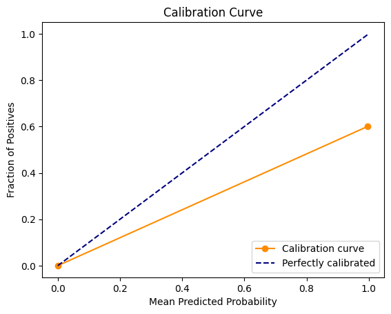

# 🎧 Audio Deepfake Detection using Deep Learning

This project focuses on identifying **audio deepfakes**—manipulated audio recordings designed to impersonate real speakers. Using deep learning techniques, the model classifies audio clips as either **genuine** (bonafide) or **spoofed** (fake), leveraging the **ASVspoof 2019** dataset.

---

## 🔍 Project Summary

- **Dataset**: ASVspoof 2019 (Logical Access)
- **Preprocessing**: Convert audio to Mel spectrograms with data augmentation
- **Model**: Convolutional Neural Network (CNN)
- **Goal**: Binary classification (real vs. fake)
- **Loss Function**: Binary Cross-Entropy
- **Optimizer**: Adam
- **Evaluation**: Accuracy, F1-score, ROC Curve, AUC
- **Visualization Tools**: `plot_model`, Netron

---

## 🧠 Model Architecture Overview

The model follows a straightforward CNN pipeline tailored for audio spectrogram classification:

1. **Convolutional Layers** – Detect patterns in time-frequency domain
2. **MaxPooling** – Reduce dimensionality and highlight dominant features
3. **Batch Normalization** – Improve training stability
4. **ReLU Activation** – Introduce non-linearity
5. **Dropout** – Regularize and prevent overfitting
6. **Global Average Pooling** – Flatten feature maps while preserving spatial context
7. **Dense Layer with Sigmoid** – Predict probability of being real or fake

<p align="center">
  
</p>

---

## 📊 Evaluation Metrics

The model's performance is measured using:

- **Accuracy**
- **F1 Score**
- **Precision-Recall Curve**
- **ROC Curve**
- **AUC (Area Under Curve)**

<p align="center">
  
  
  
</p>

---

## 🚀 Getting Started

### 🔧 Installation

## 📥 Download Dataset

Download the **ASVspoof 2019 dataset** from the [official website](https://www.asvspoof.org/) and extract it into the `dataset/` directory:


---

## 🧪 Training Pipeline

1. Convert `.flac` or `.wav` audio files into **Mel spectrograms**
2. Apply audio **data augmentations**, such as:
   - Pitch shifting
   - Noise addition
   - Time stretching
3. Train the CNN model using:
   - **Binary Cross-Entropy Loss**
   - **Adam Optimizer**
4. Evaluate and track:
   - **Accuracy**
   - **F1 Score**
   - **AUC (Area Under Curve)**

---

## 🧩 Contributing

We welcome contributions from the community! 🚀

### Steps to Contribute:

1. **Fork** the repository on GitHub.

2. **Clone** your forked repository:
   ```bash
   git clone https://github.com/jenithjain/DeepFake-Audio-Detection-AI
   cd DeepFake-Audio-Detection-AI
